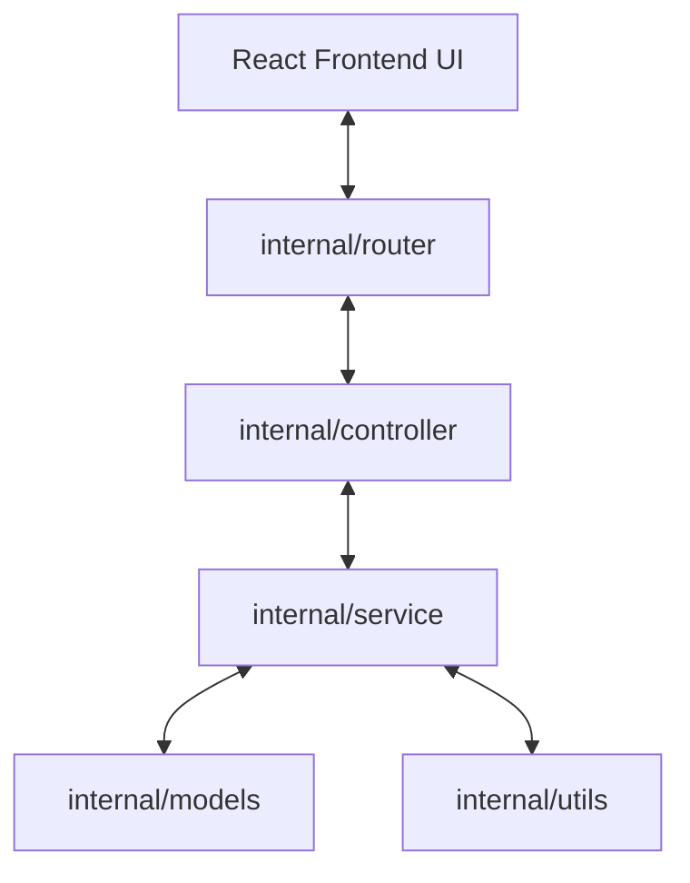

# Project Architecture & Structural Guide

This document describes the codebase structure, package relationships, API schemas, and core workflows of **EPUBForge**. It serves as an onboarding guide for AI agents and human developers modifying the application.

---

## 📂 Codebase Directory Layout

```
epubforge/
├── cmd/epubforge/          # Native application bootstrap (embeds React production UI files)
├── dist-native/            # Compiled standalone executables for all platforms (built via Node)
├── docs/                   # Developer documentation & AI agent context
├── edit/                   # Active user workspace containing EPUB files being edited
├── extensions/             # Scraper scripts folder (.js extensions parsed by the runner)
├── internal/               # Go backend implementation (private modules)
│   ├── controller/         # Fiber-like request handling & controllers
│   ├── models/             # Shared API requests, responses, and domain models
│   ├── router/             # HTTP router setup (handlers matching paths)
│   ├── service/            # Core business logic (EPUB engine, Scraper, Merger, etc.)
│   └── utils/              # Base operating system and networking helpers
├── scripts/                # Build utility scripts (Node.js packaging system)
├── src/                    # Frontend React UI SPA source code
│   ├── components/         # Modular React UI workspace panels and modals
│   ├── lib/                # API client adapters and helper utilities (api.ts)
│   ├── main.tsx            # Main React SPA bootstrap file
│   └── styles.css          # Core CSS stylesheet, HSL design tokens, responsive system
├── output/                 # Split or generated EPUB result outputs
└── .undo/                  # Folder holding backup ZIP files (if undo is active)
```

---

## 🛠️ Go Backend Architecture (`internal/`)

The Go backend follows a clean, decoupled layered architecture:



### 1. Router Layer (`internal/router/router.go`)
- Integrates static resource serving for the React UI.
- Hooks HTTP request paths to controllers using standard `http.ServeMux` routing.
- Automatically serves `index.html` on unregistered paths to support React Router SPA client paths.

### 2. Controller Layer (`internal/controller/controller.go`)
- Responsible for parsing JSON requests, query parameters, and multipart form uploads.
- Validates input formats and maps them to [models](file:///e:/epub_forge/internal/models/types.go).
- Handles HTTP response headers, content types (e.g. streaming file downloads, server-sent events), and error wrappers.

### 3. Service Layer (`internal/service/`)
Contains the heart of the EPUB engine. Below is a detailed description of each service module:

- **[epub.go](file:///e:/epub_forge/internal/service/epub.go)**: 
  - Represents the state of a book inside the `BookContext` struct.
  - Handles parsing container XML, locating the OPF rootfile, reading metadata, and mapping the manifest, spine, and TOC points.
  - Implements thread-safe `bookCache` and `titleCache` systems.
  - Manages `zipReaderCache` to keep reader handles open across calls.
- **[chapter.go](file:///e:/epub_forge/internal/service/chapter.go)**:
  - Manages all chapter-level mutations: editing HTML, adding new chapters, reordering the spine, renaming, and deleting chapters.
  - Chapter merge operations update OPF spine, NCX TOC, EPUB3 `nav.xhtml`, and visible TOC pages such as `Text/index.html` together. Smart auto-merge calls the same `action: "merge"` endpoint per group, then posts one final `/toc` update from the planned merged spine so old flat-TOC EPUBs stay consistent after batch merges.
  - Implements the **Overlay Filesystem Cache** (`edit/.overlay/{id}/`) and **Background Asynchronous ZIP writer**.
  - Implements Vietnamese typography normalization (spacing, smart quotes, tone placements).
- **[gallery.go](file:///e:/epub_forge/internal/service/gallery.go)**:
  - Allows selecting specific images inside the book to compile a structured `gallery.xhtml` page with captioning.
  - Reorders illustration entries and registers them to the manifest and TOC.
- **[merge.go](file:///e:/epub_forge/internal/service/merge.go)**:
  - Merges multiple EPUB files sequentially.
  - Unifies manifest IDs to prevent duplicates, normalizes relative stylesheet links, and merges separate TOC lists into a single consolidated tree.
- **[optimize.go](file:///e:/epub_forge/internal/service/optimize.go)**:
  - Optimizes the size of large EPUB files.
  - Trashes unused image and font resources (scans chapter HTML files for references).
  - Converts images (PNG/JPG) to highly-compressed WebP format using `go-rod` browser execution.
  - Cleans HTML structures by stripping inline styles and empty elements.
  - Uses the shared Windows-safe ZIP replacement path for direct EPUB rewrites.
- **[repair.go](file:///e:/epub_forge/internal/service/repair.go)**:
  - Scans EPUB files for standard compliance errors (missing container, broken manifest items, unlisted spine files, missing cover declarations, and malformed/syntax-error NCX XML files).
  - Implements a batch of automated repair functions, including automatic reconstruction of `toc.ncx` from the OPF spine if the existing NCX file contains syntax or tag mismatch errors.
  - Serializes direct ZIP rebuilds against the background writer and closes cached readers before replacing the EPUB file.
- **[extension.go](file:///e:/epub_forge/internal/service/extension.go)**:
  - Executes Javascript crawler scripts inside a headless browser using `go-rod`. Built-in/store extensions live in `extensions/origin/`; user-uploaded custom extensions may still be placed in `extensions/`.
  - Implements `AutoUpdateExtensions()` to check remote extensions from the official GitHub store on application startup, comparing MD5 checksums and overwriting local official files when updates are available.
  - Supports streaming screenshots and turnstile bypass indicators via SSE (Server-Sent Events) back to the UI.
  - Supports interactive choices from extensions through `utils.choose(...)`, emitted to the frontend as `choice_required` events. The UI renders checkbox/radio options and posts the selected IDs back to the active run.
  - Supports extension input schemas with `text`, `password`, `number`, `boolean`, and `select` fields. Inputs may use `visibleWhen` to show mode-specific controls.
  - Normalizes extension return values into one or more `CreateEpubRequest` payloads. A single object creates one EPUB; an array or `{ ebooks: [...] }` creates multiple EPUB files, which is the expected shape for one series page containing multiple volumes.
  - For multi-volume scrapers, each returned ebook should use the volume heading as `title`/`metadata.title`, and store the parent series name in `metadata.series` with the volume order in `metadata.seriesIndex`.
- **[create.go](file:///e:/epub_forge/internal/service/create.go)**:
  - Builds standard text EPUB files from scratch or imports plain TXT novels (split into chapters using user-defined regex headers).
- **[manga.go](file:///e:/epub_forge/internal/service/manga.go)**:
  - Compiles uploaded images into a fixed-layout, pre-paginated Manga EPUB.
  - Generates individual XHTML wrapper files for each image.
  - Sets viewport sizing headers and reads text direction (RTL/LTR) variables.

---

## 📡 Core API HTTP Reference

This reference lists all key backend endpoints exposed by the service layer:

### 1. Workspace / EPUB Management

#### `GET /api/epubs`
- **Description**: Lists all EPUB files inside the workspace `edit/` directory.
- **Response**: Array of `models.EpubFile`.

#### `POST /api/epubs/upload`
- **Description**: Uploads a new EPUB file into the workspace.
- **Request**: `multipart/form-data` with key `file`.
- **Response**: `{"success": true, "fileName": "string"}`

#### `DELETE /api/epubs/{id}`
- **Description**: Deletes a book from the workspace.
- **Response**: `{"success": true}`

#### `PATCH /api/epubs/{id}`
- **Description**: Renames an EPUB file.
- **Request Body**: `{"name": "new_name.epub"}`
- **Response**: `models.EpubFile`

#### `GET /api/epubs/{id}/analyze`
- **Description**: Returns detailed structural details of the book.
- **Response**: `models.BookAnalysis` containing spine, images, metadata, and detected volumes.

---

### 2. Chapter Editing & Cleanups

#### `GET /api/epubs/{id}/chapters/{index}/html`
- **Description**: Returns the raw or parsed HTML content of a specific chapter.
- **Query Params**: `raw=true` (returns raw XHTML content directly without rewriting link assets).
- **Response**: Raw XHTML text content.

#### `POST /api/epubs/{id}/chapters/edit`
- **Description**: Modifies book chapters.
- **Request Body**: `models.ChapterEditRequest`
  - `action`: `"save_content" | "rename" | "reorder" | "add" | "delete" | "merge" | "split"`
  - `index`: Target index of the chapter.
  - `targetIndex`: Position for reordering.
  - `content`: HTML payload for chapter content edits.
  - `newTitle`: Title update string.
- **Response**: `models.BookAnalysis` (reflecting changes).

#### `POST /api/epubs/{id}/chapters/clean`
- **Description**: Previews HTML cleaner transformations.
- **Request Body**: `models.ChapterEditRequest` containing cleanup flags (e.g. `stripInlineStyles`, `regexFilters`).
- **Response**: `{"content": "cleaned HTML string"}`

---

### 3. Gallery & Illustration Pages

#### `GET /api/epubs/{id}/gallery`
- **Description**: Retrieves all selected and available illustration images in the book.
- **Response**: `models.GalleryResponse` (selected and available images arrays).

#### `POST /api/epubs/{id}/gallery`
- **Description**: Compiles and saves the illustration gallery.
- **Request Body**: `models.SaveGalleryRequest` containing the ordered array of images and caption strings.
- **Response**: `models.BookAnalysis` (reflecting the newly generated `gallery.xhtml`).

---

### 4. Utilities, Optimization & Repair

#### `POST /api/epubs/{id}/optimize`
- **Description**: Run I/O-intensive book optimization.
- **Request Body**: `models.OptimizeRequest`
- **Response**: `models.OptimizeResponse` (details of size reduction, WebP conversions).

#### `POST /api/epubs/{id}/repair`
- **Description**: Applies automated structural repairs.
- **Request Body**: `models.RepairRequest`
- **Response**: `models.RepairResponse` (repair logs, analysis, and validation report).

#### `GET /api/epubs/{id}/validate`
- **Description**: Scans the book for formatting and metadata errors.
- **Response**: `models.ValidationReport` (issues count, warnings list).

---

### 5. Crawler Extensions (Extension Center)

#### `GET /api/extensions`
- **Description**: Lists all scraper extensions. Official/store extensions are read from `extensions/origin/`; custom uploaded extensions can live in `extensions/`.
- **Response**: Array of extension info blocks.

#### `POST /api/extensions/run?id={extension_id}`
- **Description**: Runs a scraper script. Streams logs and screenshots back as Server-Sent Events (SSE).
- **Request Body**: Map of input key-value parameters.
- **Response**: Chunked NDJSON stream of type `log`, `screenshot` (base64 data), or `done`.
- **Return Packaging**: The JavaScript `run(params)` may return one ebook object, an array of ebook objects, or `{ ebooks: [...] }`. The service packages each ebook object as an independent EPUB.

#### `POST /api/extensions/interact`
- **Description**: Simulates action inside the browser (to solve Turnstiles / Captchas).
- **Request Body**: `{"runId": "id", "action": "click | input | choice", "x": float, "y": float, "text": "string"}`
- **Response**: `{"success": true, "screenshot": "base64"}`

For `action: "choice"`, `text` is a JSON-encoded array of selected option IDs returned to `utils.choose(...)`.

---

## 🔄 Core Workflows

### 1. Headless Browser Extension Protocol
```
Frontend              Backend (extension.go)             Headless Browser
   |                             |                               |
   |---- POST /run ------------->|                               |
   |                             |---- Launches Stealth -------->|
   |                             |<--- SSE log ("Crawling...")---|
   |                             |                               |
   |                             |<--- Captcha / Turnstile Lock--|
   |                             |---- Captures Screenshot ----->|
   |<--- SSE "screenshot" -------|                               |
   |     (renders modal overlay) |                               |
   |                             |                               |
   |---- POST /interact -------->|                               |
   |     (Simulates click/input) |---- Clicks / Inputs --------->|
   |<--- Returns New Screenshot--|                               |
   |                             |---- Continues crawling ------>|
```

### 2. Manga Fixed-Layout Workflow
1. When generating a Manga EPUB via `CreateManga`, the service accepts a sequence of uploaded images.
2. For each image, the service generates a fixed-layout XHTML page:
   - Viewport metadata headers match the exact resolution of the image.
   - SVG wrapper elements scale the image to fill 100% of the screen.
3. The manifest file (`content.opf`) is configured with fixed-layout tags:
   - `<meta property="rendition:layout">pre-paginated</meta>`
   - `<meta property="rendition:orientation">auto</meta>`
   - `<meta property="rendition:spread">auto</meta>`
4. Spine items are updated with `page-spread-left` or `page-spread-right` attributes based on the reading direction configuration (RTL / LTR).
