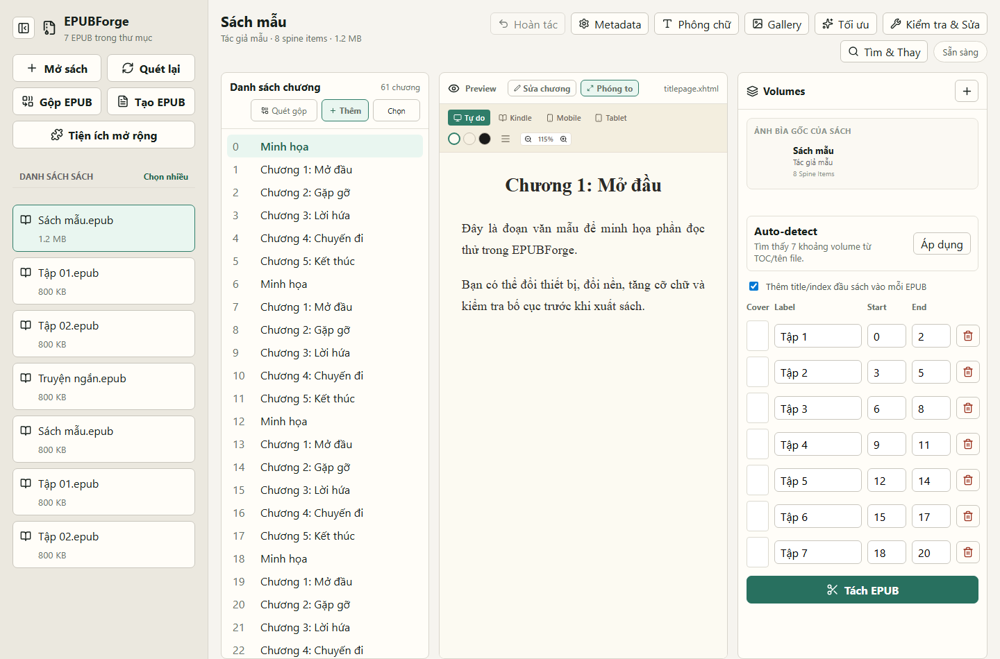
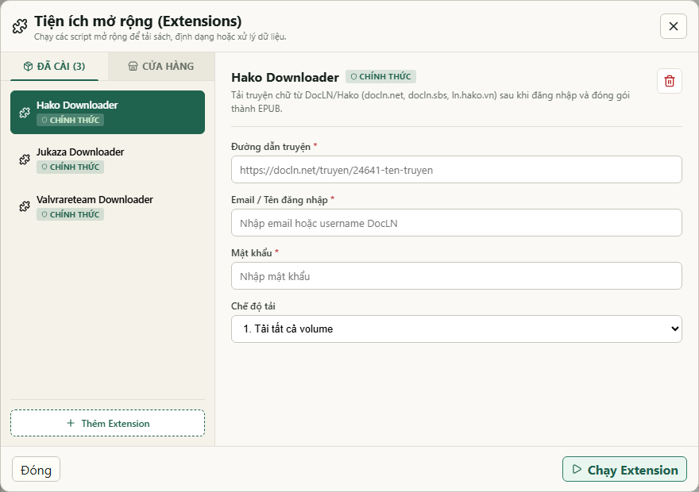
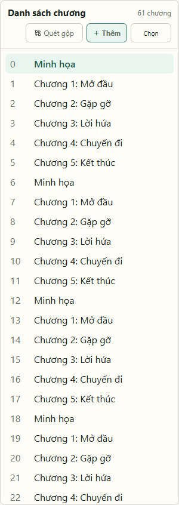
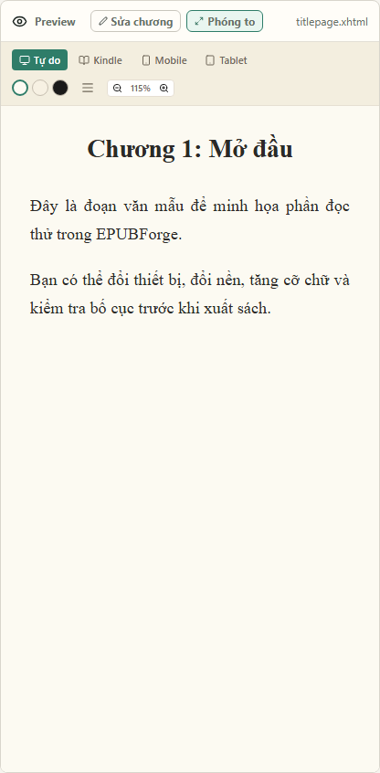
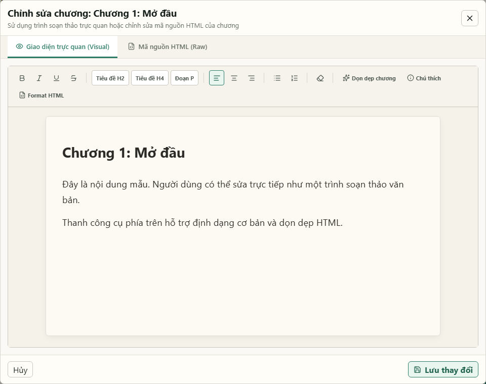
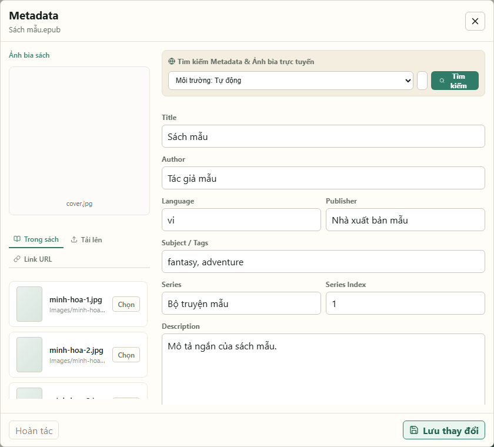
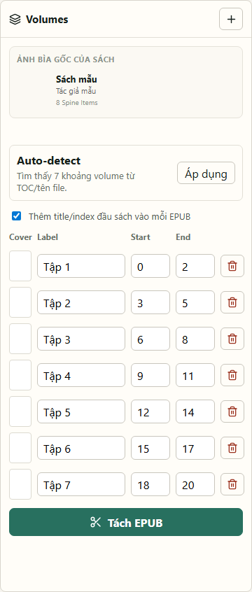
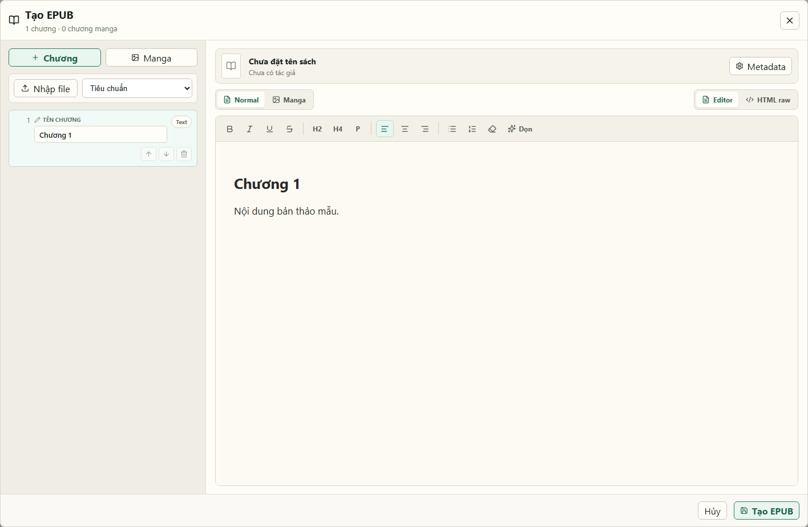
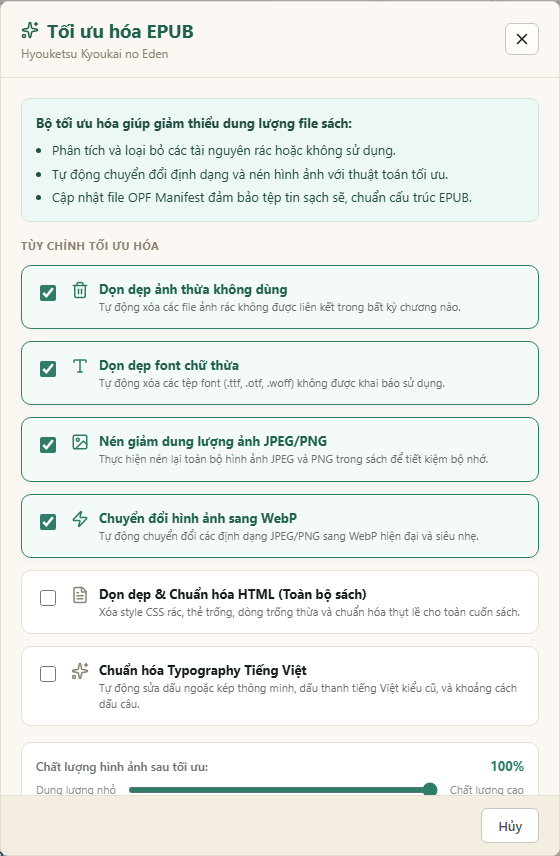
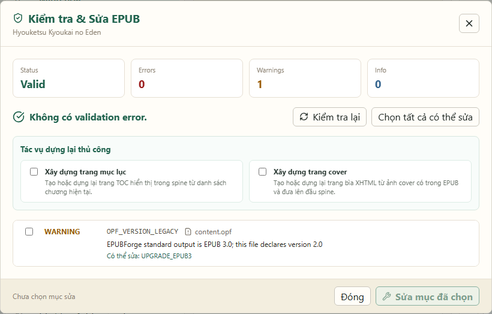

# Hướng dẫn nhanh cho người dùng EPUBForge

Tài liệu này dành cho người dùng phổ thông. Nếu bạn chỉ muốn mở sách, sửa vài chỗ, tách tập, tạo EPUB hoặc tải truyện bằng extension thì đọc file này là đủ. Bản chi tiết hơn nằm ở `docs/user-guide.md`.

## 0. EPUBForge dùng để làm gì?

EPUBForge giúp bạn:

- Mở và quản lý file EPUB.
- Sửa tên sách, tác giả, mô tả và ảnh bìa.
- Xem trước nội dung chương.
- Sửa nội dung chương như một trình soạn thảo văn bản.
- Gộp các chương bị chia nhỏ.
- Tách một EPUB lớn thành nhiều tập.
- Gộp nhiều EPUB thành một file.
- Tạo EPUB mới từ TXT, DOCX hoặc ảnh manga.
- Tải truyện từ website bằng extension.
- Dọn dung lượng, kiểm tra lỗi và sửa cấu trúc EPUB.

## 1. Mở ứng dụng

Nếu bạn dùng bản đã build, chạy file trong `dist-native/`. Ví dụ trên Windows:

```powershell
.\dist-native\epubforge-windows-amd64.exe
```

Ứng dụng sẽ tự mở trình duyệt ở địa chỉ:

```text
http://127.0.0.1:5180
```

Nếu trình duyệt không tự mở, hãy copy địa chỉ trên và dán vào Chrome, Edge hoặc trình duyệt bạn đang dùng.

## 2. Màn hình chính

Sau khi mở app, bạn sẽ thấy giao diện gồm ba phần:

- Bên trái: danh sách sách EPUB.
- Ở giữa: danh sách chương và phần xem trước.
- Bên phải: công cụ tách volume.



Các nút quan trọng ở bên trái:

- Mở sách: thêm EPUB từ máy vào app.
- Quét lại: làm mới danh sách sách.
- Gộp EPUB: gộp nhiều sách EPUB thành một.
- Tạo EPUB: tạo sách mới từ text, DOCX hoặc ảnh.
- Tiện ích mở rộng: tải truyện từ website bằng extension.

## 3. Tải truyện bằng extension

Bấm Tiện ích mở rộng ở thanh bên trái.



Luồng dùng cơ bản:

1. Chọn extension ở danh sách bên trái.
2. Nhập link truyện và các thông tin cần thiết.
3. Chọn chế độ tải nếu extension có.
4. Bấm Chạy Extension.
5. Theo dõi log chạy.
6. Nếu app yêu cầu chọn volume/chapter, hãy chọn rồi xác nhận.
7. Nếu hiện captcha, click hoặc nhập chữ theo hướng dẫn trong cửa sổ tương tác.

Extension chính thức thường dùng:

- Hako Downloader: tải truyện từ DocLN/Hako.
- Jukaza Downloader: tải truyện từ Jukaza.
- Valvrareteam Downloader: tải truyện từ Valvrareteam, có thể dùng tài khoản nếu truyện/chương bị khóa.

Lưu ý: Các extension chính thức (nằm trong thư mục `extensions/origin/`) sẽ được ứng dụng tự động kiểm tra và cập nhật lên phiên bản mới nhất từ Github Store mỗi khi khởi động.

Không nên lưu tài khoản/mật khẩu thật vào file extension. Hãy nhập trong giao diện khi cần.

## 4. Thêm hoặc mở sách EPUB

1. Bấm Mở sách.
2. Chọn một hoặc nhiều file `.epub`.
3. Chờ app thêm sách vào danh sách bên trái.
4. Click vào tên sách để mở.

Mẹo: EPUBForge làm việc trong thư mục `edit/`. Khi bạn mở sách bằng nút Mở sách, app sẽ copy file vào thư mục này.

## 5. Xem và quản lý chương

Danh sách chương nằm ở panel bên trái của workspace.



Bạn có thể:

- Click một chương để xem nội dung.
- Kéo thả chương để đổi thứ tự.
- Bấm biểu tượng bút chì để đổi tên chương.
- Bấm biểu tượng thùng rác để xóa chương.
- Bấm Thêm để thêm chương mới.
- Bấm Chọn để chọn nhiều chương.
- Bấm Quét gộp để app tự tìm các chương bị chia nhỏ như `1.1`, `1.2`, `2a`, `2b`.

Khi nào nên dùng Quét gộp?

- Khi một chương bị tách thành nhiều phần.
- Ví dụ: `Chương 1.1`, `Chương 1.2` nên gộp thành `Chương 1`.
- Sau khi gộp, app sẽ cập nhật lại mục lục cho EPUB.

## 6. Xem trước chương

Panel Preview ở giữa cho bạn đọc thử chương hiện tại.



Bạn có thể:

- Chọn kiểu xem Tự do, Kindle, Mobile hoặc Tablet.
- Đổi màu nền sáng, sepia hoặc tối.
- Tăng/giảm cỡ chữ.
- Bật/tắt căn đều hai bên.
- Bấm Phóng to để xem trong cửa sổ lớn.
- Bấm Sửa chương để chỉnh nội dung.

Các tùy chỉnh trong Preview chỉ để xem thử, không tự thay đổi nội dung EPUB.

## 7. Sửa nội dung chương

Bấm Sửa chương trong panel Preview.



Ở màn hình sửa chương, bạn có hai chế độ:

- Giao diện trực quan: sửa giống như soạn thảo văn bản.
- Mã nguồn HTML: sửa trực tiếp mã HTML nếu bạn biết HTML.

Các nút thường dùng:

- B, I, U: đậm, nghiêng, gạch chân.
- Tiêu đề H2, Tiêu đề H4, Đoạn P: đổi kiểu đoạn.
- Căn trái, giữa, phải.
- Danh sách bullet hoặc danh sách số.
- Dọn dẹp chương: xóa style rác, dòng trống và chuẩn hóa nội dung.
- Chú thích: chèn footnote.
- Lưu thay đổi: ghi nội dung vào EPUB.

Lưu ý: sau khi bấm Lưu thay đổi, file EPUB trong `edit/` sẽ được cập nhật.

## 8. Sửa thông tin sách và ảnh bìa

Bấm Metadata trên thanh trên cùng.



Bạn có thể sửa:

- Title: tên sách.
- Author: tác giả.
- Language: ngôn ngữ, ví dụ `vi`.
- Publisher: nhà xuất bản hoặc nhóm dịch.
- Subject / Tags: thể loại, tag.
- Series và Series Index: tên bộ và số tập.
- Description: mô tả sách.

Đổi ảnh bìa:

- Trong sách: chọn ảnh đã có sẵn trong EPUB.
- Tải lên: chọn ảnh từ máy.
- Link URL: dán link ảnh trực tiếp.

Tìm metadata online:

- Chọn nguồn Tự động, AniList, Google Books hoặc Open Library.
- Nhập tên sách.
- Bấm Tìm kiếm.
- Click kết quả phù hợp để tự điền thông tin.

Sau khi sửa xong, bấm Lưu thay đổi.

## 9. Tách một EPUB thành nhiều tập

Panel Volumes nằm bên phải.



Cách làm nhanh:

1. Nếu app tự tìm được volume, bấm Áp dụng ở ô Auto-detect.
2. Kiểm tra từng dòng range:
   - Label: tên tập xuất ra.
   - Start: chương bắt đầu.
   - End: chương kết thúc.
3. Bấm ô Cover nếu muốn chọn bìa riêng cho tập đó.
4. Bấm Tách EPUB.
5. File kết quả sẽ nằm trong `output/`.

Khi nào bật Thêm title/index đầu sách vào mỗi EPUB?

- Bật nếu bạn muốn mỗi tập xuất ra vẫn có trang đầu/mục lục đầu sách.
- Tắt nếu bạn chỉ muốn lấy đúng các chương trong range.

## 10. Gộp nhiều EPUB thành một

1. Bấm Gộp EPUB ở thanh bên trái.
2. Chọn ít nhất hai EPUB.
3. Sắp xếp thứ tự gộp bằng nút lên/xuống.
4. Nhập tên sách sau khi gộp.
5. Bấm Bắt đầu gộp.

Sách đầu tiên trong danh sách gộp sẽ được ưu tiên lấy metadata và ảnh bìa.

## 11. Tạo EPUB mới

Bấm Tạo EPUB ở thanh bên trái.



Bạn có thể:

- Tự viết chương mới.
- Import file `.txt`.
- Import file `.docx`.
- Tạo chương manga bằng cách upload nhiều ảnh.

Khi import TXT/DOCX, app có thể:

- Tự tách chương bằng regex.
- Mỗi file là một chương.
- Gộp tất cả file vào một chương.

Khi tạo manga:

- Chọn ảnh cho từng chương.
- Sắp xếp ảnh A-Z hoặc tự đổi thứ tự.
- Chọn hướng đọc RTL cho manga Nhật hoặc LTR cho comic/webtoon.

Sau khi nhập đủ nội dung, bấm Tạo EPUB. Sách mới sẽ xuất hiện trong danh sách bên trái.


## 12. Tối ưu dung lượng EPUB

Bấm Tối ưu trên thanh trên cùng.



Bạn có thể:

- Xóa ảnh thừa không dùng.
- Xóa font thừa không dùng.
- Nén ảnh.
- Chuyển ảnh sang WebP.
- Dọn HTML.
- Chuẩn hóa dấu câu và typography tiếng Việt.

Nếu bạn không chắc, hãy giữ các lựa chọn mặc định. Với sách cần tương thích rộng, cân nhắc tắt Chuyển ảnh sang WebP vì một số máy đọc cũ hỗ trợ WebP không tốt.

## 13. Kiểm tra và sửa lỗi EPUB

Bấm Kiểm tra & Sửa trên thanh trên cùng.



App sẽ quét EPUB và báo:

- Lỗi nghiêm trọng.
- Cảnh báo.
- Thông tin thêm.
- Mục nào có thể sửa tự động.

Cách dùng:

1. Bấm Chọn tất cả có thể sửa nếu muốn sửa nhanh.
2. Hoặc tick từng mục bạn muốn sửa.
3. Bấm Sửa mục đã chọn.
4. Chờ app cập nhật lại sách.

Tính năng này hữu ích khi EPUB bị thiếu mục lục, lỗi cấu trúc XML của file `toc.ncx`, sai manifest, link ảnh hỏng hoặc thiếu trang cover.

## 14. Tìm và thay thế

Bấm Tìm & Thay trên thanh trên cùng.

Bạn có thể:

- Tìm chữ thường.
- Tìm bằng regex.
- Tìm trong chương hiện tại hoặc toàn bộ sách.
- Thay một kết quả.
- Thay toàn bộ kết quả.

Ví dụ dễ hiểu:

- Tìm `Chuong` và thay bằng `Chương`.
- Tìm tên nhóm dịch cũ và thay bằng tên mới.
- Dùng regex để xóa quảng cáo lặp lại trong nhiều chương.
.

## 15. Nên làm theo thứ tự nào?

Với EPUB đã có sẵn:

1. Mở sách.
2. Kiểm tra Metadata và bìa.
3. Sửa/gộp chương nếu cần.
4. Tìm & Thay các lỗi lặp lại.
5. Kiểm tra & Sửa EPUB.
6. Tối ưu dung lượng.
7. Tách volume hoặc xuất file kết quả.

Với truyện tải từ website:

1. Mở Tiện ích mở rộng.
2. Chọn extension đúng website.
3. Nhập link truyện.
4. Chạy extension.
5. Mở EPUB mới để kiểm tra chương, bìa và mục lục.
6. Dùng Tối ưu hoặc Kiểm tra & Sửa nếu cần.

Với sách tự tạo:

1. Mở Tạo EPUB.
2. Nhập metadata.
3. Import TXT/DOCX hoặc thêm chương thủ công.
4. Kiểm tra chương trong Preview.
5. Sửa lỗi nội dung.
6. Bấm Tạo EPUB.

## 18. Lỗi thường gặp

Không thấy sách mới:

- Bấm Quét lại.
- Kiểm tra file có đuôi `.epub`.
- Kiểm tra app đang chạy đúng thư mục dự án.

Không sửa/xóa được EPUB:

- Đóng app đọc EPUB bên ngoài nếu đang mở cùng file.
- Thử lại sau vài giây.

Ảnh không hiện:

- Chạy Kiểm tra & Sửa.
- Kiểm tra ảnh có nằm trong EPUB không.

Extension chạy thiếu chương:

- Kiểm tra log.
- Nếu chương bị khóa, nhập tài khoản nếu extension hỗ trợ.
- Nếu vẫn không có quyền, có thể tài khoản không được phép đọc chương đó.

File sau tối ưu bị giảm chất lượng ảnh:

- Dùng bản backup.
- Tăng chất lượng ảnh.
- Tắt chuyển WebP nếu thiết bị đọc sách quá cũ.

## 19. Ghi nhớ nhanh

- File làm việc nằm trong `edit/`.
- File tách volume thường nằm trong `output/`.
- Sửa chương, metadata, tối ưu và sửa lỗi sẽ ghi vào EPUB đang mở.
- Trước thao tác lớn, nên backup file gốc.
- Bản hướng dẫn đầy đủ hơn nằm ở `docs/user-guide.md`.
